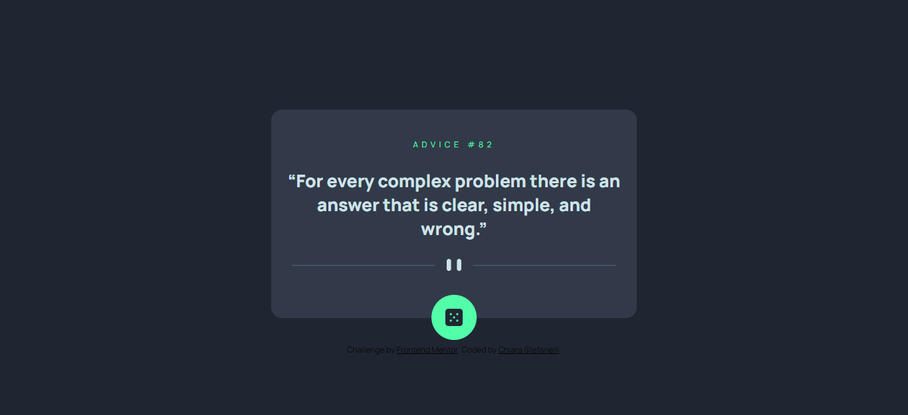

# Frontend Mentor - Advice generator app solution

This is a solution to the [Advice generator app challenge on Frontend Mentor](https://www.frontendmentor.io/challenges/advice-generator-app-QdUG-13db). Frontend Mentor challenges help you improve your coding skills by building realistic projects.

## Screenshot

## Links

- [Solution URL](https://www.frontendmentor.io/solutions/advice-generator-app-7YuzbFVRJH)
- [Live Site URL](https://advice-generator-website-frontendmentor.netlify.app/) (hosted on Netlify)

## The challenge

Users should be able to:

- View the optimal layout for the app depending on their device's screen size
- See hover states for all interactive elements on the page
- Generate a new piece of advice by clicking the dice icon

## Built with

- Semantic HTML5 markup
- CSS custom properties
- JavaScript
- Mobile-first workflow
- [Advice Slip API](https://api.adviceslip.com/)

## Author

Chiara Stefanelli - Front-End Development Student based in Italy

- Website - [Chiara Stefanelli](https://chiarastefanelli.netlify.app/)
- LinkedIn - [Chiara Stefanelli](https://www.linkedin.com/in/chiarastefanelli/?locale=en_US)
